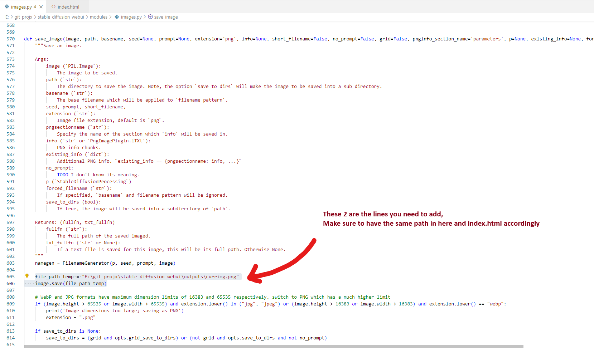

# ViewSDimageInNewTab
 This guide shows you how to view sd images in a new tab and refresh automagically ( automatic1111 )

[Video Demo and Instructions](https://www.youtube.com/watch?v=NSsbxw7jB3Q) : If you came here from the video, that's great !

* Edit stable-diffusion-webui\modules\images.py as below <br>
```
file_path_temp = "E:\git_projx\stable-diffusion-webui\outputs\currimg.png" #change this to whatever you want
image.save(file_path_temp)
```
<br><br>
* Save the  file ,and edit the path to the image in there accordingly <br>
* Enjoy !!!! <br>
* I know this is a fugly way to do it, but until it's added in to automatic1111 webui, you can use this. 
